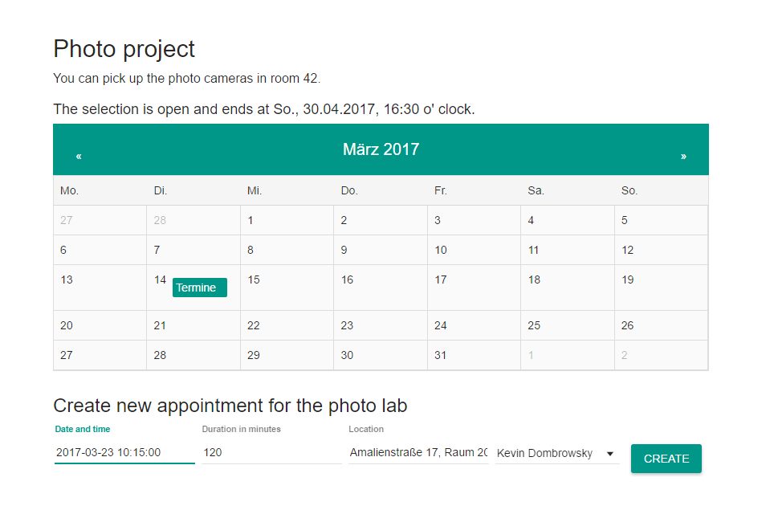
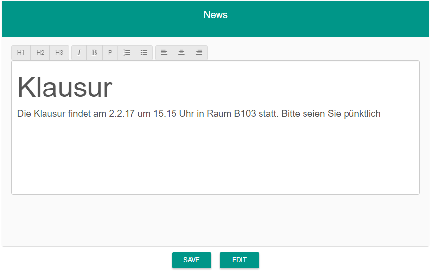
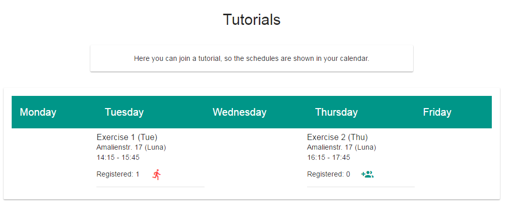

# mtPlanr - Media Technology Angular Frontend

## Content
* [Installation](#installation)
* [General Information](#general-information)
* [First Start](#first-start)
* [Home](#home)
* [Whitelists](#whitelists)
* [Groups](#groups)
* [Labs](#labs)
* [News](#news)
* [Priority Distribution](#priority-distribution)
* [Weekly Exercises](#weekly-exercises)
* [Schedule Management](#schedule-management)
* [User Management](#user-management)
* [Semester Management](#semester-management)

## Deployment

Surf to mtplanr.herokuapp.com to test the app with test data.

Warning: Some of the test data is randomly created and might not make sense. 
For a clean Start Backend has to be started using the production_seed.js
 
(See Backend [Readme](https://gitlab.lrz.de/nikolaifischer/mt-common-api) for more info)

## Installation
1. Download the repository
2. Install npm modules: `npm install`
3. Install bower dependencies `bower install`
4. Start up the server: `node server.js`
5. View in browser at http://localhost:8080

Edit app.js to point the app to a local API for testing!

THIS APP CAN ONLY WORK IF PROVIDED A VALID URL FOR A MEDIA TECHNOLOGY API

--------------------------------------

## General Information

* There are 3 user levels:
  * Student
    - Can participate in labs and exercises and create or enter groups
  * Tutor
    - Can create and exercises and labs
  * Administrator
    - Has full rights to edit, delete and create

# First Start

1. Log in as Admin using the credentials "admin@mt.medien.ifi.lmu.de" and password "mtplanr"
2. Change the password by selecting the red user icon in the top left corner and clicking "Profile"
2. A pop-up appears which allows you to create a new Semester. Do this to avoid errors.
3. Access the "Admin Tools" by selecting the red user icon in the top left corner and click "Admin Tools"
4. From here you can configure the app.

-------------

## Home

The home screen is where a user gets important information depending on his role.
For example a student will see: 

**Group**

The group the user is a member of including names and email addresses of other group members.

**News**

Current information about the course, provided by tutors or admins.

**Calendar**

In the calendar are displayed all important dates for each user.
On click you can see details (time, location,...) of the appointment.

Student:
* Unique Dates (Exam,...)
* Exercises he/she assigned to in exercises tab
* Labs his/her group got assigned to after the algorithm processed the priorities

Tutor:
* Unique Dates (Exam,...)
* Exercises he/she is assigned to as tutor
* Labs he/she is assigned to as tutor

Admin:
* Unique Dates (Exam,...)

## Whitelists 
**(User Creation)**

Whitelists are used to allow only specific users (participants of the course) to
register accounts for this platform.

A User is identified by his/her E-Mail Address. If a user is not present on the whitelist, he can not create an account for this Platform.

After user successfully registered his entry is deleted from the whitelist, as it is not longer needed.

**Edit the whitelist**

* As an **Admin**  navigate to the Admin Tools and select "Whitelist Management"
* This will take you to a view of the current whitelist
* To Edit an entry just type something and press save
* To Delete an entry press the red trash icon
* To **add** entries to the white list you can either:
  * Add it manually by pressing the "add" Button at the buttom of the list and typing a name
  and email
  * Upload a **Uniworx** CSV file with the participants of a course
    * Press Upload CSV
    * Select the CSV from your computer
    * After the Upload you will be prompted the parsed data, check if it is correct
    * If it is not correct edit the csv and reupload it
    * If it's correct you can click on "Save"
* You can also specify user rights in the whitelist. If a user should have tutor rights when
he is creating his account, flip the tutor switch to "on".

## Groups

Students of the course have to be organized into **groups** to participate in **labs** (see below). Groups have to be of a certain size, which is configurable in the "Semester Management" in the Admin tools.
When a student logs into the platform and is not yet part of a group a message appears on the homescreen,
asking the user to join a group. A click on the message takes the user to the group menu:

**Joining a Group**

In the Group Menu the user can either:
* Create a new group by putting in the E-Mail addresses of the other team members (who also have an account)
* Join a random group: This will let the user join a group with free spaces or create a new one if there is none. After that other student can randomly join this group.

**Leaving a Group**

If a user wants to leave a group, he can do so by pressing the read "Leave" button on the home-screen.

**ATTENTION**: If a user leaves a group all other members are also removed from the group and have to organize themselves in groups
again.

## Labs

There are 3 LabTypes (Photo, Video and Audio). Every Group has to select 3 Priorities for each of the LabTypes. An algorithm decides which dates are assigned to which group.

**Edit LabTypes**

* As Admin select LabType Management in the Admin Tools.
* Edit the descriptions for Tutors and Students. These description will be shown in the respective lab tab.
* Set a deadline for the priority selection. After this date, students will not be able to select priorities.
* Open the priority selection with the switch (do this when enough Lab appointments for the respective LabType are created).

**Create Labs**

* As Admin or Tutor go to the tab where you want to create a new Lab appointment (Photo project, Video project or Audio project)
* Below the calendar you can set date and time, duration, location and tutor of the appointment.
* Hit the "Create" button. If the creation was successfully there will be a success message below the formular and the new appointment will be shown on the respective date in the calendar.
* Click on the day in the calendar to see details of the lab appointment on the right.
* Lab appointments that you are assigned as tutor are displayed below the formular. You can click on them to see details.

**Edit or delete Labs**

* As Admin or Tutor go to the tab where you want to edit or delete a lab appointment (Photo project, Video project or Audio project)
* Select the day in the calendar on which you want to edit or delete a lab appointment
* Edit:
   * Right of the calendar, click on the pen icon of the lab appointment you want to edit
   * After you made some changes click the "Save" Button
* Delete
   * Right of the calendar, click on the trash can icon of the lab appointment you want to delete
   * Confirm in the alert popup that you want to delete the appointment
   * Labs on which a group already saved a priority can not be deleted
   

**Save/Delete Priorities**

* As Student who is member in a group you can select 3 date priorities for each of the LabTypes.
* If the selection is opened by the admin go to the tab where you want to save priorities (Photo project, Video project or Audio project).
* On top of the calendar you see if the selection is open, the time of the deadline and if you are in a group and can save priorities.
* Click on a calendar day where "Appointments" are displayed in color.
* Right of the calendar you see each lab appointment that takes place on the clicked day.
* On the dropdown of each appointment you can select priority 1, 2 or 3 and save it by hitting the "Save" button next to the dropdown.
* Already saved priorities for your group are displayed below the calendar.
* You can there delete priorities by clicking the trash can icon next to the saved priority.
* If you select and save a priority that already has been saved to another date, the priority date is updated.
* The algorithm only considers groups that have 3 saved priorities by the deadline time.

## News

Tutors and Admins can edit the news panel every user sees when logging in to platform. They can do this
by pressing the "Edit" button below the news panel and using the HTML-Editor.

## Priority Distribution

After the students have prioritized the dates for the labs, the **Admin** can start an automatic distribution of the lab dates.
In the **Admin Menu** select "Distribution of Lab Dates" and follow the instruction on the screen.

The automatic distribution is done by an algorithm. The algorithm selects dates for the groups, based on the priorities given by the groups on dates.
In the beginning, a high (1) priority is preferred to a low (3) priority. After groups get low on dates, groups with less dates get preferred to groups with more dates.
In the end, the dates will get distributed fair and reasonable to all groups. Description of algorithm(only in german) -> https://github.com/nikolaifischer/Media-Technology/wiki/Algorithmus-Beschreibung

Before a distribution should be started, several checks on the date have to be passed:

After the distribution algorithm finished the Admin is prompted with a screen showing him the groups 
which were successfully assigned and the groups for which no lab date could be found: There is a small chance that some groups
picked their priorities in a way that no free labs could be found. In this case the scheduling of Lab Dates should
be done manually.

If you want to E-Mail those groups, you can either do this one at a time by pressing the mail icon (which will tell you the E-Mail Address of the group creator) next to the group
or by pressing the "Export Emails" Button. This will display a comma-separated list of E-Mail Addresses which can than be copied
in your favourite E-Mail program to write an E-Mail.

## Weekly Exercises

The exercises can be managed by clicking on the Exercises tab in the menu. The displayed content depends on the user's role:
* As Student you can attend an exercise by clicking the add-member icon next to an exercise appointment or leave an exercise by clicking the red running man icon.

* As Admin or Tutor you can create exercises by clicking on the plus button of a certain weekday and fill in the form in the popup dialog.

You can also delete exercises by clicking on the red trash icon next to an exercise.

## Schedule Management

As Admin you can create various appointments e.g. for exams or other important dates, which are then displayed in the
calendar of each user of the platform. Over the Schedule Management panel in the Admin tools you get to the page,
where you can create and delete such appointments, either by filling in the form for creating or clicking the red trash
icon next to an exisiting appointment for deleting it.

## User Management

As Admin you can manage the users of the platform by going to the user management page over the User Management panel in
the Admin tools. There you can delete users by clicking the red trash icon next to one or edit his properties like name,
email and term. The users are divided in Tutors and Students.

## Semester Management

As admin you can create a term and edit the current term in the Semester Management tool, and also view previous terms.

